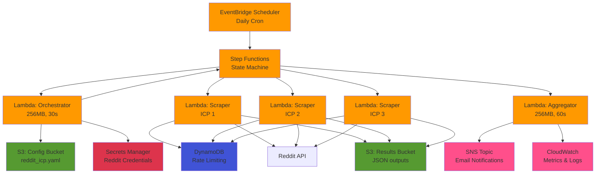
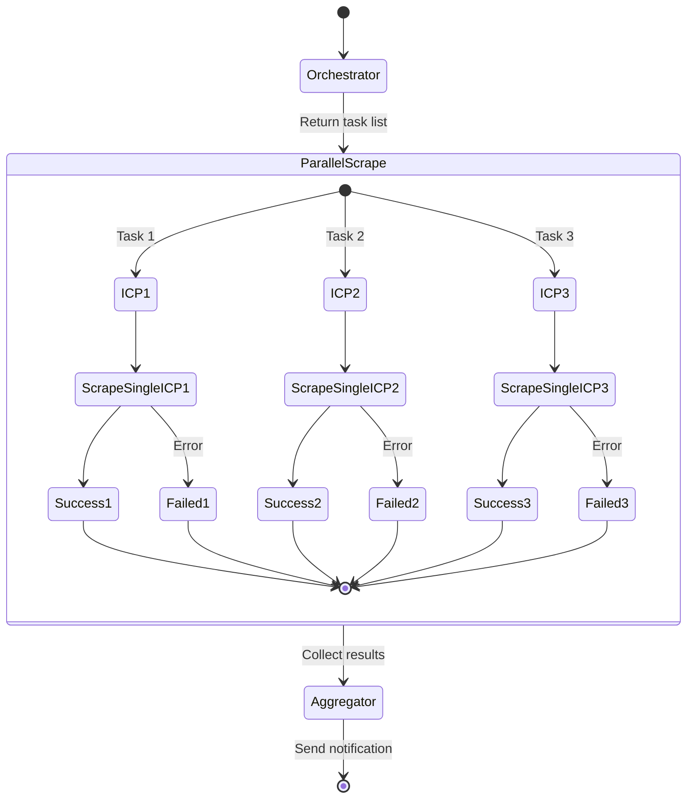
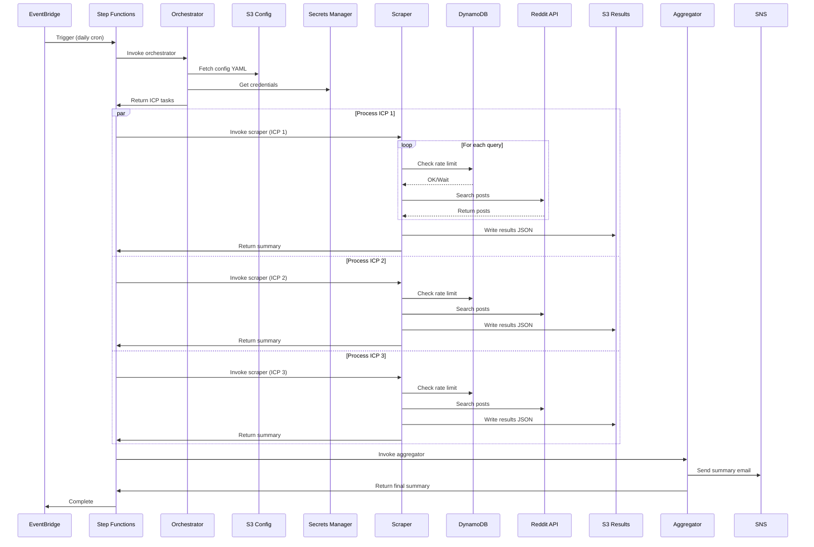
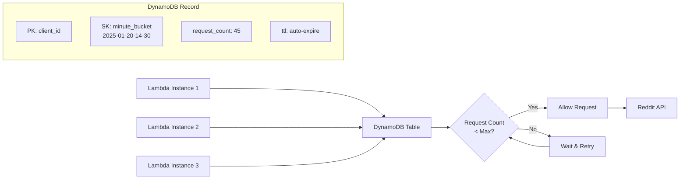
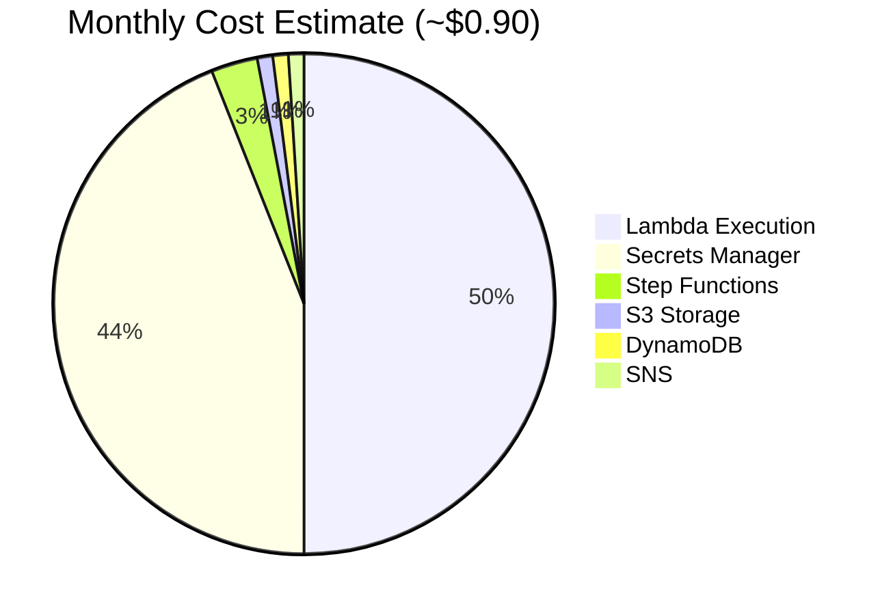

# Architecture Diagrams

## High-Level Architecture

```mermaid
graph TB
    EB[EventBridge Scheduler<br/>Daily Cron] --> SF[Step Functions<br/>State Machine]
    SF --> L1[Lambda: Orchestrator<br/>256MB, 30s]
    L1 --> S3C[S3: Config Bucket<br/>reddit_icp.yaml]
    L1 --> SM[Secrets Manager<br/>Reddit Credentials]
    L1 --> SF
    
    SF --> L2A[Lambda: Scraper<br/>ICP 1]
    SF --> L2B[Lambda: Scraper<br/>ICP 2]
    SF --> L2C[Lambda: Scraper<br/>ICP 3]
    
    L2A --> DDB[DynamoDB<br/>Rate Limiting]
    L2B --> DDB
    L2C --> DDB
    
    L2A --> REDDIT[Reddit API]
    L2B --> REDDIT
    L2C --> REDDIT
    
    L2A --> S3R[S3: Results Bucket<br/>JSON outputs]
    L2B --> S3R
    L2C --> S3R
    
    SF --> L3[Lambda: Aggregator<br/>256MB, 60s]
    L3 --> SNS[SNS Topic<br/>Email Notifications]
    L3 --> CW[CloudWatch<br/>Metrics & Logs]
    
    style EB fill:#FF9900
    style SF fill:#FF9900
    style L1 fill:#FF9900
    style L2A fill:#FF9900
    style L2B fill:#FF9900
    style L2C fill:#FF9900
    style L3 fill:#FF9900
    style S3C fill:#569A31
    style S3R fill:#569A31
    style DDB fill:#4053D6
    style SM fill:#DD344C
    style SNS fill:#FF4F8B
    style CW fill:#FF4F8B
```

## Step Functions Workflow

```mermaid
stateDiagram-v2
    [*] --> Orchestrator
    Orchestrator --> ParallelScrape: Return task list
    
    state ParallelScrape {
        [*] --> ICP1: Task 1
        [*] --> ICP2: Task 2
        [*] --> ICP3: Task 3
        
        ICP1 --> ScrapeSingleICP1
        ICP2 --> ScrapeSingleICP2
        ICP3 --> ScrapeSingleICP3
        
        ScrapeSingleICP1 --> Success1
        ScrapeSingleICP2 --> Success2
        ScrapeSingleICP3 --> Success3
        
        ScrapeSingleICP1 --> Failed1: Error
        ScrapeSingleICP2 --> Failed2: Error
        ScrapeSingleICP3 --> Failed3: Error
        
        Success1 --> [*]
        Success2 --> [*]
        Success3 --> [*]
        Failed1 --> [*]
        Failed2 --> [*]
        Failed3 --> [*]
    }
    
    ParallelScrape --> Aggregator: Collect results
    Aggregator --> [*]: Send notification
```

## Data Flow

```mermaid
sequenceDiagram
    participant EB as EventBridge
    participant SF as Step Functions
    participant L1 as Orchestrator
    participant S3C as S3 Config
    participant SM as Secrets Manager
    participant L2 as Scraper
    participant DDB as DynamoDB
    participant Reddit as Reddit API
    participant S3R as S3 Results
    participant L3 as Aggregator
    participant SNS as SNS

    EB->>SF: Trigger (daily cron)
    SF->>L1: Invoke orchestrator
    L1->>S3C: Fetch config YAML
    L1->>SM: Get credentials
    L1->>SF: Return ICP tasks
    
    par Process ICP 1
        SF->>L2: Invoke scraper (ICP 1)
        loop For each query
            L2->>DDB: Check rate limit
            DDB-->>L2: OK/Wait
            L2->>Reddit: Search posts
            Reddit-->>L2: Return posts
        end
        L2->>S3R: Write results JSON
        L2->>SF: Return summary
    and Process ICP 2
        SF->>L2: Invoke scraper (ICP 2)
        L2->>DDB: Check rate limit
        L2->>Reddit: Search posts
        L2->>S3R: Write results JSON
        L2->>SF: Return summary
    and Process ICP 3
        SF->>L2: Invoke scraper (ICP 3)
        L2->>DDB: Check rate limit
        L2->>Reddit: Search posts
        L2->>S3R: Write results JSON
        L2->>SF: Return summary
    end
    
    SF->>L3: Invoke aggregator
    L3->>SNS: Send summary email
    L3->>SF: Return final summary
    SF->>EB: Complete
```

## Rate Limiting Strategy

```mermaid
graph LR
    L1[Lambda Instance 1] --> DDB[DynamoDB Table]
    L2[Lambda Instance 2] --> DDB
    L3[Lambda Instance 3] --> DDB
    
    DDB --> Check{Request Count<br/>< Max?}
    Check -->|Yes| Allow[Allow Request]
    Check -->|No| Wait[Wait & Retry]
    
    Allow --> Reddit[Reddit API]
    Wait --> Check
    
    subgraph "DynamoDB Record"
        PK[PK: client_id]
        SK[SK: minute_bucket<br/>2025-01-20-14-30]
        RC[request_count: 45]
        TTL[ttl: auto-expire]
    end
```

## Cost Breakdown

```mermaid
pie title Monthly Cost Estimate (~$0.90)
    "Lambda Execution" : 50
    "Secrets Manager" : 44
    "Step Functions" : 3
    "S3 Storage" : 1
    "DynamoDB" : 1
    "SNS" : 1
```
