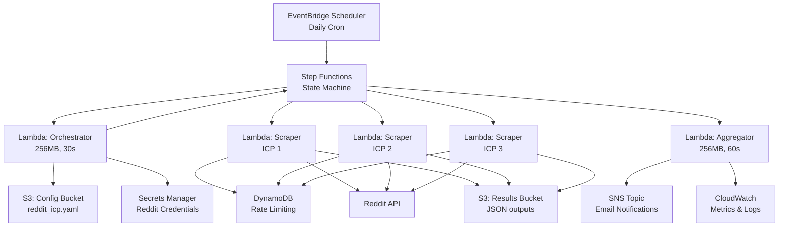
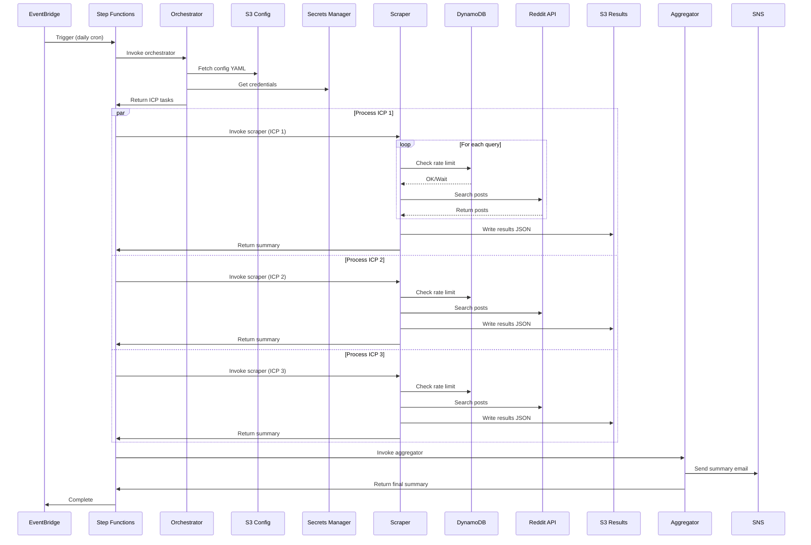

# AWS Lambda Deployment

Complete guide for deploying the Reddit ICP Scraper to AWS Lambda with Step Functions orchestration.

## Quick Start

```bash
# 1. Install AWS SAM CLI
pip install aws-sam-cli

# 2. Store Reddit credentials
aws secretsmanager create-secret \
  --name reddit-scraper/credentials \
  --secret-string '{"client_id":"...","client_secret":"...","user_agent":"..."}'

# 3. Build and deploy
sam build
sam deploy --guided

# 4. Upload config
aws s3 cp config/reddit_icp.yaml s3://YOUR-CONFIG-BUCKET/

# 5. Test execution
aws stepfunctions start-execution \
  --state-machine-arn YOUR-STATE-MACHINE-ARN \
  --input '{"config_bucket":"...","config_key":"reddit_icp.yaml","output_bucket":"..."}'
```

## Architecture Overview

**4 Lambda Functions + Step Functions:**

1. **Orchestrator** (30s, 256MB): Load config from S3, fan out ICP tasks
2. **Scraper** (15min, 512MB): Scrape Reddit per ICP with rate limiting
3. **Summarizer** (5min, 512MB): Summarize posts with Bedrock, send ICP emails to SNS
4. **Aggregator** (60s, 256MB): Collect results, send summary notification

**Key Features:**
- Parallel processing (2-3 ICPs concurrently)
- DynamoDB-based distributed rate limiting
- Fault tolerance with Step Functions retry logic
- Config-driven from S3
- ~$0.90/month cost

## Architecture Diagrams

### High-Level Architecture



### Data Flow



## Lambda Functions

### 1. Orchestrator Lambda

**Purpose**: Load config from S3, fan out ICP processing tasks

**Configuration:**
- Timeout: 30 seconds
- Memory: 256 MB
- Trigger: Step Functions

**Input:**
```json
{
  "config_bucket": "my-reddit-scraper-config",
  "config_key": "reddit_icp.yaml",
  "output_bucket": "my-reddit-scraper-results"
}
```

**Output:**
```json
{
  "tasks": [
    {
      "icp_name": "Marketing Agencies",
      "icp_config": {...},
      "defaults": {...},
      "credentials": {...},
      "output_bucket": "my-reddit-scraper-results"
    }
  ]
}
```

### 2. ICP Scraper Lambda

**Purpose**: Scrape Reddit for a single ICP with rate limiting

**Configuration:**
- Timeout: 15 minutes
- Memory: 512 MB
- Reserved Concurrency: 2-3
- Trigger: Step Functions (parallel execution)

**Responsibilities:**
- Initialize Reddit client with credentials
- Build queries from keyword buckets
- Fetch posts from subreddits (with rate limiting)
- Apply filters and scoring
- Write results to S3 as JSON

**Output:**
```json
{
  "icp_name": "Marketing Agencies",
  "posts_found": 15,
  "output_key": "results/marketing_agencies_20250120.json",
  "execution_time_seconds": 245
}
```

### 3. ICP Summarizer Lambda

**Purpose**: Summarize posts with Bedrock Claude Haiku and send individual emails per ICP via SNS

**Configuration:**
- Timeout: 5 minutes
- Memory: 512 MB
- Trigger: Step Functions (after all scrapers complete)

**Responsibilities:**
- Load post results from S3
- Summarize each post body using Bedrock Claude Haiku (2-3 sentences focusing on pain points)
- Build formatted email with summaries, engagement metrics, and URLs
- Send one email per ICP to SNS topic

**Email Format:**
Each ICP receives a dedicated email containing:
- Post title
- AI-generated summary highlighting pain points
- Engagement metrics (score, comments, upvote ratio)
- Original Reddit URL for full context

**Output:**
```json
{
  "status": "emails_sent",
  "icp_count": 3
}
```

**IAM Permissions Required:**
- `s3:GetObject` on results bucket
- `bedrock:InvokeModel` for Claude Haiku (anthropic.claude-3-haiku-20240307-v1:0)
- `sns:Publish` to notification topic

### 4. Aggregator Lambda

**Purpose**: Collect results, send notifications

**Configuration:**
- Timeout: 1 minute
- Memory: 256 MB
- Trigger: Step Functions (after all scrapers complete)

**Output:**
```json
{
  "total_icps": 3,
  "successful": 3,
  "failed": 0,
  "total_posts": 45,
  "execution_summary": [...]
}
```

## AWS Resources

### S3 Buckets
- **Config Bucket**: Stores `reddit_icp.yaml`
- **Results Bucket**: Stores JSON outputs with lifecycle policy (archive to Glacier after 90 days)

### Secrets Manager
- **Secret Name**: `reddit-scraper/credentials`
```json
{
  "client_id": "...",
  "client_secret": "...",
  "user_agent": "reddit_icp_scraper/1.0"
}
```

### DynamoDB Table (Rate Limiting)
- **Table Name**: `reddit-scraper-rate-limits`
- **Partition Key**: `client_id` (String)
- **Sort Key**: `minute_bucket` (String, format: `YYYY-MM-DD-HH-MM`)
- **Attributes**: `request_count` (Number), `ttl` (Number, auto-expire after 1 hour)

### EventBridge Rule
- **Schedule**: `cron(0 9 * * ? *)` - Daily at 9 AM UTC
- **Target**: Step Functions State Machine

### IAM Roles

Lambda Execution Role needs:
- `s3:GetObject` on config bucket
- `s3:PutObject` on results bucket
- `secretsmanager:GetSecretValue` for credentials
- `dynamodb:PutItem`, `dynamodb:GetItem`, `dynamodb:UpdateItem` for rate limiting
- `logs:CreateLogGroup`, `logs:CreateLogStream`, `logs:PutLogEvents`
- `sns:Publish` for notifications (Aggregator only)

## Rate Limiting

Reddit API allows ~60 requests/minute. Implementation uses DynamoDB for distributed rate limiting:

```python
import time
import boto3
from datetime import datetime

dynamodb = boto3.resource('dynamodb')
table = dynamodb.Table('reddit-scraper-rate-limits')

def check_rate_limit(client_id: str, max_per_minute: int = 50) -> bool:
    minute_bucket = datetime.utcnow().strftime('%Y-%m-%d-%H-%M')
    
    try:
        response = table.update_item(
            Key={'client_id': client_id, 'minute_bucket': minute_bucket},
            UpdateExpression='ADD request_count :inc SET ttl = :ttl',
            ExpressionAttributeValues={
                ':inc': 1,
                ':ttl': int(time.time()) + 3600,
                ':max': max_per_minute
            },
            ConditionExpression='attribute_not_exists(request_count) OR request_count < :max',
            ReturnValues='ALL_NEW'
        )
        return True
    except dynamodb.meta.client.exceptions.ConditionalCheckFailedException:
        return False
```

## Deployment Guide

### Prerequisites

- AWS CLI configured with appropriate credentials
- AWS SAM CLI installed (`pip install aws-sam-cli`)
- Reddit API credentials (client_id, client_secret)
- Python 3.11

### Step-by-Step Deployment

#### 1. Store Reddit Credentials

```bash
aws secretsmanager create-secret \
  --name reddit-scraper/credentials \
  --description "Reddit API credentials for ICP scraper" \
  --secret-string '{
    "client_id": "YOUR_CLIENT_ID",
    "client_secret": "YOUR_CLIENT_SECRET",
    "user_agent": "reddit_icp_scraper/1.0"
  }'
```

#### 2. Build SAM Application

```bash
sam build
```

#### 3. Deploy to AWS

```bash
# First deployment (guided)
sam deploy --guided

# Follow prompts:
# - Stack Name: reddit-scraper
# - AWS Region: us-east-1 (or your preferred region)
# - Parameter ConfigBucketName: reddit-scraper-config-YOURNAME
# - Parameter ResultsBucketName: reddit-scraper-results-YOURNAME
# - Confirm changes before deploy: Y
# - Allow SAM CLI IAM role creation: Y
# - Save arguments to configuration file: Y

# Subsequent deployments
sam deploy
```

#### 4. Upload Configuration to S3

```bash
# Get bucket name from stack outputs
CONFIG_BUCKET=$(aws cloudformation describe-stacks \
  --stack-name reddit-scraper \
  --query 'Stacks[0].Outputs[?OutputKey==`ConfigBucket`].OutputValue' \
  --output text)

# Upload config
aws s3 cp config/reddit_icp.yaml s3://${CONFIG_BUCKET}/reddit_icp.yaml
```

#### 5. Enable Bedrock Model Access

```bash
# Request access to Claude 3 Haiku in your AWS region
# Go to: AWS Console > Bedrock > Model access
# Enable: anthropic.claude-3-haiku-20240307-v1:0
```

**Note**: Model access must be enabled before the Summarizer Lambda can function.

#### 6. Subscribe to SNS Notifications

```bash
# Get SNS topic ARN
SNS_TOPIC=$(aws cloudformation describe-stacks \
  --stack-name reddit-scraper \
  --query 'Stacks[0].Outputs[?OutputKey==`NotificationTopicArn`].OutputValue' \
  --output text)

# Subscribe your email
aws sns subscribe \
  --topic-arn ${SNS_TOPIC} \
  --protocol email \
  --notification-endpoint your-email@example.com

# Confirm subscription via email
```

#### 7. Test the Workflow

```bash
# Get state machine ARN
STATE_MACHINE=$(aws cloudformation describe-stacks \
  --stack-name reddit-scraper \
  --query 'Stacks[0].Outputs[?OutputKey==`StateMachineArn`].OutputValue' \
  --output text)

# Start execution manually
aws stepfunctions start-execution \
  --state-machine-arn ${STATE_MACHINE} \
  --input '{
    "config_bucket": "reddit-scraper-config-YOURNAME",
    "config_key": "reddit_icp.yaml",
    "output_bucket": "reddit-scraper-results-YOURNAME"
  }'
```

#### 8. Monitor Execution

```bash
# View CloudWatch logs
sam logs -n reddit-scraper --stack-name reddit-scraper --tail

# View results in S3
aws s3 ls s3://${RESULTS_BUCKET}/results/
```

## Updating the Application

### Update Configuration

```bash
# Edit config locally
vim config/reddit_icp.yaml

# Upload to S3
aws s3 cp config/reddit_icp.yaml s3://${CONFIG_BUCKET}/reddit_icp.yaml
```

### Update Lambda Code

```bash
# Make code changes
vim lambda/scraper/handler.py

# Rebuild and deploy
sam build
sam deploy
```

### Update Secrets

```bash
aws secretsmanager update-secret \
  --secret-id reddit-scraper/credentials \
  --secret-string '{
    "client_id": "NEW_CLIENT_ID",
    "client_secret": "NEW_CLIENT_SECRET",
    "user_agent": "reddit_icp_scraper/1.0"
  }'
```

## Monitoring & Operations

### CloudWatch Metrics
- Custom metrics: `PostsScraped`, `ICPProcessingTime`, `RateLimitHits`
- Lambda metrics: Duration, Errors, Throttles

### CloudWatch Alarms
- Scraper Lambda errors > 1 in 5 minutes
- Step Function execution failures
- DynamoDB throttling

### SNS Notifications
- Daily summary email with results
- Error alerts for failed executions

### View Logs

```bash
# Orchestrator logs
aws logs tail /aws/lambda/reddit-orchestrator --follow

# Scraper logs
aws logs tail /aws/lambda/reddit-scraper --follow

# Aggregator logs
aws logs tail /aws/lambda/reddit-aggregator --follow
```

## Troubleshooting

### Lambda Timeout Issues

If scraper Lambda times out:
1. Reduce `per_query_limit` in config
2. Reduce number of keyword buckets
3. Increase Lambda timeout in template.yaml

### Rate Limit Errors

If hitting Reddit rate limits:
1. Check DynamoDB table for request counts
2. Reduce `MaxConcurrency` in Step Functions (template.yaml)
3. Increase delays in scraper code

### No Posts Found

1. Check CloudWatch logs for filter/scoring issues
2. Verify subreddit names in config
3. Adjust `min_final_score` threshold
4. Check Reddit API credentials

## Cost Estimate

Monthly cost for daily execution (3 ICPs):

| Service | Cost |
|---------|------|
| Lambda (Orchestrator) | $0.00 |
| Lambda (Scraper) | $0.45 |
| Lambda (Summarizer) | $0.00 |
| Lambda (Aggregator) | $0.00 |
| Bedrock (Claude Haiku) | $0.15 |
| Step Functions | $0.03 |
| S3 | $0.01 |
| DynamoDB | $0.01 |
| Secrets Manager | $0.40 |
| **Total** | **~$1.05** |

**Bedrock Cost Details:**
- Input tokens: ~$0.25 per 1M tokens
- Output tokens: ~$1.25 per 1M tokens
- Typical usage: 20 posts × 3 ICPs × 200 tokens = ~12K tokens/day
- Monthly estimate: ~$0.15

### Cost Optimization Tips

- Use EventBridge schedule to run only when needed
- Set appropriate Lambda memory sizes (current: 256-512 MB)
- Use S3 lifecycle policies to archive old results
- Monitor CloudWatch metrics to optimize execution time
- Consider using Lambda reserved concurrency to control costs

## Security Best Practices

- Never commit credentials to git
- Use least-privilege IAM policies
- Enable S3 bucket encryption
- Enable CloudTrail for audit logging
- Rotate Reddit API credentials periodically
- Use VPC endpoints if running in VPC

## Cleanup

To remove all resources:

```bash
# Delete stack
sam delete --stack-name reddit-scraper

# Delete S3 buckets (must be empty)
aws s3 rm s3://${CONFIG_BUCKET} --recursive
aws s3 rb s3://${CONFIG_BUCKET}
aws s3 rm s3://${RESULTS_BUCKET} --recursive
aws s3 rb s3://${RESULTS_BUCKET}

# Delete secret
aws secretsmanager delete-secret \
  --secret-id reddit-scraper/credentials \
  --force-delete-without-recovery
```

## Key Differences from Local Implementation

The Lambda implementation is optimized for AWS deployment with some simplifications:

- **Parallel execution**: Multiple ICPs processed concurrently (vs sequential in local)
- **Distributed rate limiting**: DynamoDB-based (vs local QPS tracking)
- **Simplified scoring**: Basic keyword/recency scoring (vs full engagement/penalty scoring in local)
- **Config from S3**: Not local file system
- **Secrets from Secrets Manager**: Not .env file

For full-featured local development with advanced filtering and scoring, use the `src/` directory implementation.
